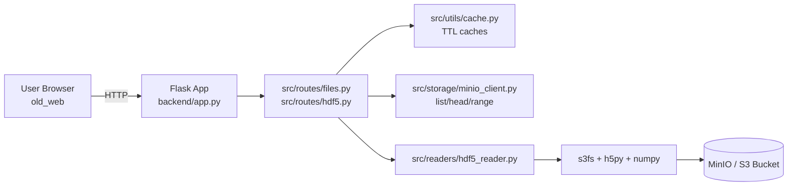
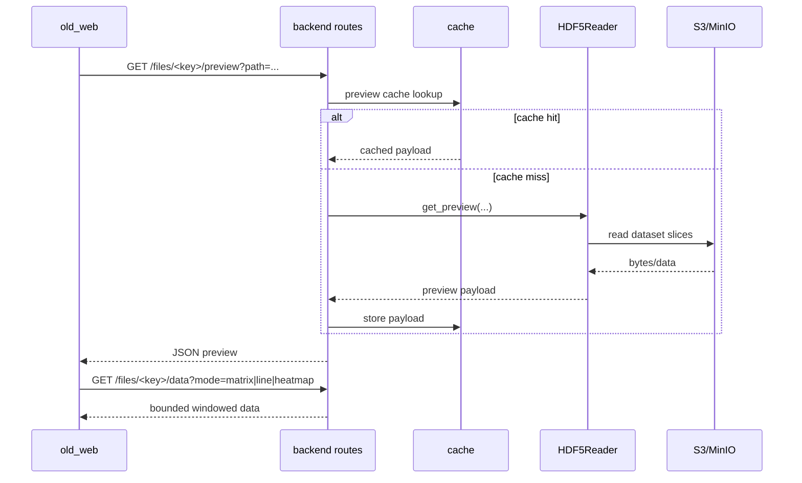
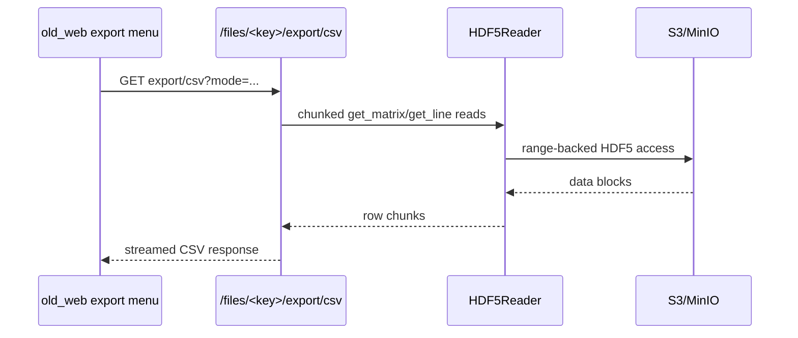

# HDF Viewer

HDF Viewer is a full-stack system for browsing, inspecting, and visualizing HDF5 files stored in MinIO or S3-compatible storage.

The current production UI is `old_web/` (vanilla ES modules).  
The API server is `backend/` (Flask).

## Current Stack

| Layer | Directory | Status | Core Tech |
|---|---|---|---|
| Backend API | `backend/` | Active | Flask, boto3, s3fs, h5py, numpy |
| Frontend UI | `old_web/` | Active | HTML, CSS, vanilla JS (ES modules), SVG/Canvas |
| Next UI | `frontend/` | In development | Not primary runtime |

## Required Libraries

Backend dependencies (from `backend/requirements.txt`):

- `flask==3.0.0`
- `flask-cors==4.0.0`
- `python-dotenv==1.0.0`
- `boto3==1.34.34`
- `numpy==1.26.4`
- `h5py==3.10.0`
- `s3fs==2024.2.0`

Frontend (`old_web`) has no npm/build dependency. It runs directly in browser as static files.

## Architecture Diagram



## Workflow Diagrams

### 1. Browse and render data



### 2. Full CSV export



## Repository Layout

```text
HDF Viewer/
  backend/      # Flask API
  old_web/      # Active frontend (static SPA)
  frontend/     # Next frontend (WIP)
  docs/         # Agent context and project notes
  AGENTS.md
  README.md
```

## End-to-End Setup (Short)

### 1) Start backend

```bash
cd backend
python -m venv venv
venv\Scripts\activate
pip install -r requirements.txt
python app.py
```

Backend default URL: `http://localhost:5000`

### 2) Start frontend (old_web)

From repository root:

```bash
python -m http.server 8080
```

Open:

- `http://localhost:8080/old_web/index.html`

### 3) Configure frontend API URL

Set API base via:

- `old_web/config/runtime-config.js` using `window.__CONFIG__.API_BASE_URL`, or
- fallback in `old_web/js/config.js`

## Backend Configuration

Required environment variables:

- `S3_ENDPOINT`
- `S3_ACCESS_KEY`
- `S3_SECRET_KEY`
- `S3_BUCKET`

Optional:

- `S3_REGION` (default `us-east-1`)
- `HOST` (default `0.0.0.0`)
- `PORT` (default `5000`)
- `DEBUG` (`true`/`false`)
- `BACKEND_PUBLIC_URL` or `PUBLIC_BASE_URL` or `API_BASE_URL` or `BACKEND_URL`

## API Surface (Current)

- `GET /`
- `GET /health`
- `GET /files/`
- Returns file and folder entries (folder rows have `type: "folder"` and `is_folder: true`).
- `POST /files/refresh`
- `GET /files/<key>/children`
- `GET /files/<key>/meta`
- `GET /files/<key>/preview`
- `GET /files/<key>/data`
- `GET /files/<key>/export/csv`

## Key Implemented Product Features

- HDF5 tree browsing with lazy children loading.
- Metadata inspection and raw type/filter info.
- Multi-mode preview and full data windows for matrix, line, and heatmap.
- Line compare mode in `old_web` with compatibility checks.
- Export features in `old_web`:
- Matrix: CSV displayed + CSV full
- Line: CSV displayed + CSV full + PNG
- Heatmap: CSV displayed + CSV full + PNG
- Backend streamed full CSV export endpoint with chunked reads.

## Testing

Backend route tests:

```bash
cd backend
python -m unittest tests/test_hdf5_routes.py
```

## Documentation Map

- Backend guide: `backend/README.md`
- Frontend guide: `old_web/README.md`
- Backend module docs:
- `backend/src/routes/README.md`
- `backend/src/readers/README.md`
- `backend/src/storage/README.md`
- `backend/src/utils/README.md`
- Frontend module docs:
- `old_web/js/README.md`
- `old_web/js/components/viewerPanel/runtime/README.md`
- Agent change logs: `docs/AGENT_CONTEXT_*.md`
